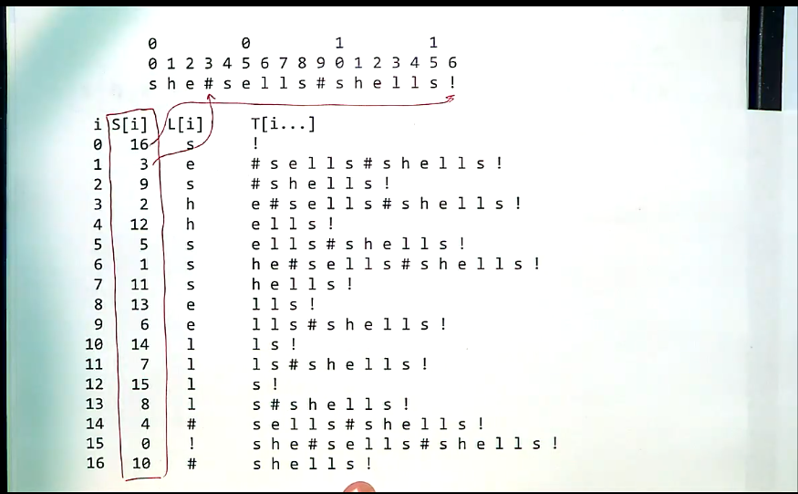
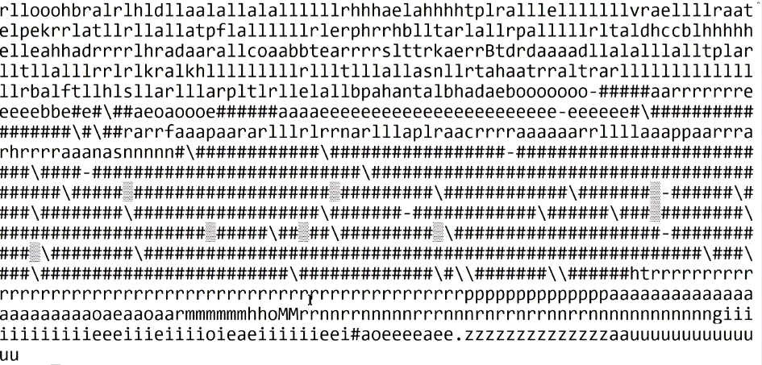

# Lecture 7.3

suffice array construction is an active area of algorithmic research - best methods are O(n) overall, but take a lot of space.

## Indexing - Exercises

**Problem:**

An inverted index is an alphabetical list of all the words that appear, together with the line numbers at which they appear.
Write a program to generate this.

Assume at most 10,000 words in the input.

## Suffix Array v2

What is the L[i] column?

- character which just precedes that suffix

[Burrows-Wheeler transform](https://en.wikipedia.org/wiki/Burrows%E2%80%93Wheeler_transform)

[suffix arrays and btw](https://web.stanford.edu/class/cs262/presentations/lecture5.pdf)

> everything we show is examinable, but to varying degrees - can't do everything within a given timeframe