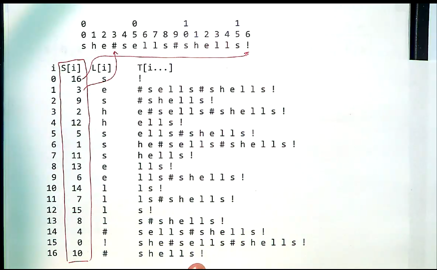
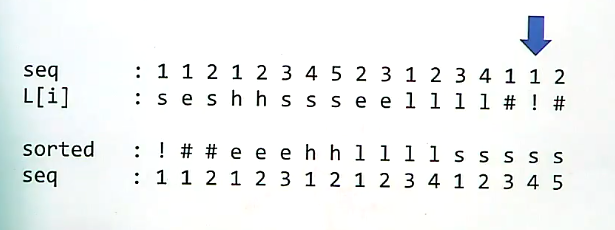

# Burrows-Wheeler transform

[[back to pattern search]](./README.md)

- [Burrows-Wheeler transform (on Wikipedia)](https://en.wikipedia.org/wiki/Burrows%E2%80%93Wheeler_transform)

Let  be the character that immediately precedes the suffix . If the suffix is the whole string, then, we wrap around and use the final character `!` instead. See the image below:



If we sort all of these s then we get a text that is more easily compressible (has more repeated letters)



Example on a larger text:


The amazing thing, is that you can reconstruct the original text From this thing!

- goes through a deterministic procedure, where many similar symbols get grouped together.
  - happens because burrows wheeler transform comes from the *suffix array*
- this can then be compressed / decompressed by avoiding repeated chars
- then apply inverse burrows wheeler transform back to get the original text

Example on `sells_sea_shells`


```
sells_sea_shells

s
lls
hells
_shells
ea_shells
_sea_shells
ls_sea_shells
ells_sea_shells

- sorting the suffix array

0     s  
9     s  ea_shells
15    s  ells_sea_shells
3     e  lls
2     l  ls
1     l  s
16    
6     _  shells
11    s  _sea_shells

1 1 2 1 3 4 2 3 1 2 3 1 1 2 4 5 1
s e s h s s e e l l l _  a e e e h l l l l s s s s s _ _


# todo: explain how the reversing process works:

sells_sea_shells$

```


