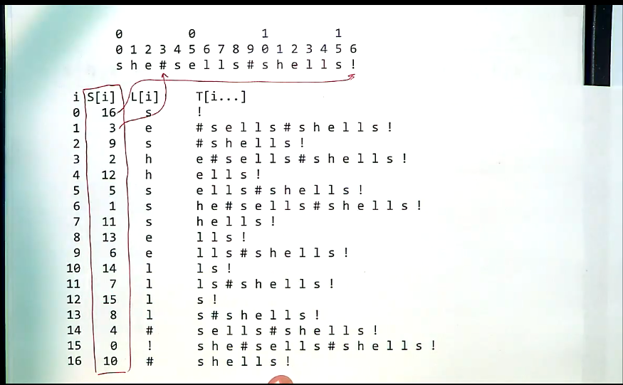

# Lecture 7.3: Suffix Arrays

[[back to pattern search]](./README.md)

Links:
- [Stanford Lecture Notes - on suffix arrays and Burrows-Wheeler Transform](https://web.stanford.edu/class/cs262/presentations/lecture5.pdf)

## Problem

What happens if $T$ is fixed and large ($m$ << $n$) and there are multiple independent patterns to be checked. Is there a way of precomputing an *index*?

## Meet suffix arrays

A *suffix array* $S[0...n-1]$ is an array of pointers S[i] such that $T_{S[i]}$ lexicographically precedes $T_{S[i+1]}$.

How to construct one?

1. add a new symbol, sentinel symbol which is smaller than any other symbol in the alphabet (in this case `!`)

2. take all possible suffixes (from length 1 to length of whole string)

3. sort the suffixes lexicographically (alphabetical order)

Ends up looking like this:



To find an arbitrary pattern in this text, you can binary search the suffix array! Binary search, thus need $log_2(n)$ steps to search for the pattern. e.g.: if $n=1000000000$ (a billion), it will take only thirty steps. THen you need only maximum $m$ string comparisons.

Note: all we actually need to store is the numbers $S[i]$, not each substring $T[i...]$.

- Total time is $O(m \log n)$ per search. That's very fast.

## Suffix array construction

- simple approach: use a $O(n \log n)$ comparison-based sorting algorithm with each comparison requiring as many as $n$ steps, which is $O(n^2 \log n)$ average case and $O(n^3)$ worst case. Not good.

- With ternary quicksort:
  - partition on one character, at depth $d$ in the strings, then do **three** recursive calls
  - roughly improves the worst case from $O(n^3)$ to $O(n^2)$.

- Suffix array construction is an active area of algorithmic research - best methods are O(n) overall, but take a lot of space.

## Another example:

If the source $T$ is large, but fixed, and you want to test with a whole bunch of smaller patterns (i.e.: $m << n$)

Generate an array of suffixes

```
                           012345
For example for the string banana

6 $
5 a$
4 na$
3 ana$
2 nana$
1 anana$
0 banana$

6 $
5 a$
3 ana$
1 anana$
0 banana$
4 na$
2 nana$

then the suffix array will look like this:

i       0 1 2 3 4 5 6

A[i]    6 5 3 1 0 4 2

```

one can then perform a binary search from that suffix array...

e.g.: if we want to see if the pattern 'na' exists within our text.at

start at `i=3`... that suffix is `anana$`. That is too close to the start of the alphabet. So we choose `i=4` instead. Then we try `banana$`. That is also to close to the start. `i=5` then gives `na$` as required. We've found the pattern in the text.

$O(log(n))$ string comparisons
up to $m$ character comparisons per string comparison

Total compexity: $O(m \cdot log(n))$.

However - generating the suffix array requires a sort: $O(nlogn)$, each comparison requires as many as $n$ steps. Therefore $O(n^2 log(n))$ - not great at all!


## More uses for suffix arrays:

- finding repeated substrings (find all locations in $S$ where repeated subsequences appear)

- key-word in context
  - can use an inverted index (an alphabetical listing of all word that appear, together with the line numbers at which they appear)

## Ternary quicksort

*TODO:* how is this related?

- choose only 1 letter as a pivot, rather than the whole word..

- then we have the less than, equal to first letter, and greater than sides. hence *ternary* quicksort.

- then there is a parameter called `depth` - controls which letter of the word we are sorting at.